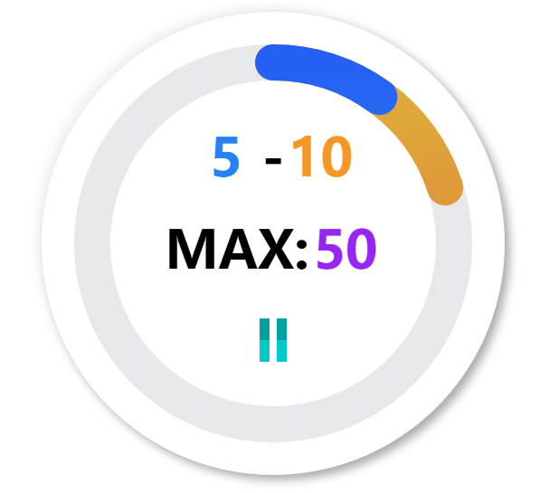

<h1 align="center"> 战败惩罚——郊狼游戏控制器</h1>
<div align="center">
  <a href="https://github.com/hyperzlib/DG-Lab-Coyote-Game-Hub/actions"></a>
  <a href="https://github.com/hyperzlib/DG-Lab-Coyote-Game-Hub/releases"></a>
  <a href="https://github.com/hyperzlib/DG-Lab-Coyote-Game-Hub/commits/main/"></a>
</div>
<p></p>
<div align="center">
  <a href="https://github.com/hyperzlib/DG-Lab-Coyote-Game-Hub/actions">下载</a>
  |
  <a href="https://www.bilibili.com/video/BV17m421G7fm/">预览</a>
  |
  <a href="docs/api.md">插件API</a>
</div>
<p></p>
<div align="center">
  
</div>

## 注意事项

请遵守直播平台的相关规定，不要违规使用本组件，如果使用本组件造成直播间封禁等后果与本组件作者无关。

## 使用方法（二进制发行版）

1. 从[Github Actions](https://github.com/hyperzlib/DG-Lab-Coyote-Game-Hub/actions)下载编译后的文件：[点击跳转](https://github.com/hyperzlib/DG-Lab-Coyote-Game-Hub/actions)
2. 解压后运行```coyote-game-hub-server.exe```启动服务器

## 使用方法（命令行）

（以下样例中使用了```pnpm```安装依赖，你也可以使用```npm```或者```yarn```）

1. 进入```server```目录，运行```pnpm install```安装依赖

2. 进入```frontend```目录，运行```pnpm install```安装依赖

3. 在项目根目录运行```pnpm install```安装依赖，运行```npm run build```编译项目

4. 在项目根目录运行```npm start```启动服务器

5. 浏览器打开```http://localhost:8920```，即可看到控制面板

## 项目结构

- ```server```：服务器端代码
- ```frontend```：前端代码

## 构建

### 环境准备
在全局环境安装下面的包：
```
npm install -g nexe 
npm install -g vite
npm install -g pkg
```

### 构建工程
按顺序运行下面的指令
```
npm run build
npm run build:pkg
npm run build:pkg:assets
npm run build:pkg:nodejs
npm run build:pkg:linux
npm run build:pkg
```

### 产物位置
之后可以在 `build/` 目录下发现构建的产物