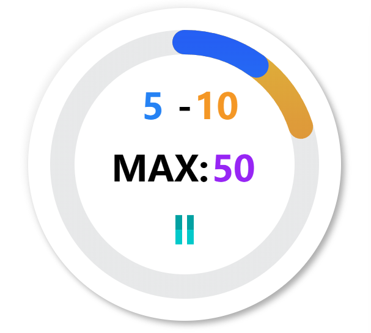

<div align="right">
  <details>
    <summary >🌐 Language</summary>
    <div>
      <div align="center">
        <a href="https://openaitx.github.io/view.html?user=hyperzlib&project=DG-Lab-Coyote-Game-Hub&lang=en">English</a>
        | <a href="https://openaitx.github.io/view.html?user=hyperzlib&project=DG-Lab-Coyote-Game-Hub&lang=zh-CN">简体中文</a>
        | <a href="https://openaitx.github.io/view.html?user=hyperzlib&project=DG-Lab-Coyote-Game-Hub&lang=zh-TW">繁體中文</a>
        | <a href="https://openaitx.github.io/view.html?user=hyperzlib&project=DG-Lab-Coyote-Game-Hub&lang=ja">日本語</a>
        | <a href="https://openaitx.github.io/view.html?user=hyperzlib&project=DG-Lab-Coyote-Game-Hub&lang=ko">한국어</a>
        | <a href="https://openaitx.github.io/view.html?user=hyperzlib&project=DG-Lab-Coyote-Game-Hub&lang=hi">हिन्दी</a>
        | <a href="https://openaitx.github.io/view.html?user=hyperzlib&project=DG-Lab-Coyote-Game-Hub&lang=th">ไทย</a>
        | <a href="https://openaitx.github.io/view.html?user=hyperzlib&project=DG-Lab-Coyote-Game-Hub&lang=fr">Français</a>
        | <a href="https://openaitx.github.io/view.html?user=hyperzlib&project=DG-Lab-Coyote-Game-Hub&lang=de">Deutsch</a>
        | <a href="https://openaitx.github.io/view.html?user=hyperzlib&project=DG-Lab-Coyote-Game-Hub&lang=es">Español</a>
        | <a href="https://openaitx.github.io/view.html?user=hyperzlib&project=DG-Lab-Coyote-Game-Hub&lang=it">Italiano</a>
        | <a href="https://openaitx.github.io/view.html?user=hyperzlib&project=DG-Lab-Coyote-Game-Hub&lang=ru">Русский</a>
        | <a href="https://openaitx.github.io/view.html?user=hyperzlib&project=DG-Lab-Coyote-Game-Hub&lang=pt">Português</a>
        | <a href="https://openaitx.github.io/view.html?user=hyperzlib&project=DG-Lab-Coyote-Game-Hub&lang=nl">Nederlands</a>
        | <a href="https://openaitx.github.io/view.html?user=hyperzlib&project=DG-Lab-Coyote-Game-Hub&lang=pl">Polski</a>
        | <a href="https://openaitx.github.io/view.html?user=hyperzlib&project=DG-Lab-Coyote-Game-Hub&lang=ar">العربية</a>
        | <a href="https://openaitx.github.io/view.html?user=hyperzlib&project=DG-Lab-Coyote-Game-Hub&lang=fa">فارسی</a>
        | <a href="https://openaitx.github.io/view.html?user=hyperzlib&project=DG-Lab-Coyote-Game-Hub&lang=tr">Türkçe</a>
        | <a href="https://openaitx.github.io/view.html?user=hyperzlib&project=DG-Lab-Coyote-Game-Hub&lang=vi">Tiếng Việt</a>
        | <a href="https://openaitx.github.io/view.html?user=hyperzlib&project=DG-Lab-Coyote-Game-Hub&lang=id">Bahasa Indonesia</a>
        | <a href="https://openaitx.github.io/view.html?user=hyperzlib&project=DG-Lab-Coyote-Game-Hub&lang=as">অসমীয়া</
      </div>
    </div>
  </details>
</div>

<h1 align="center"> 战败惩罚——郊狼游戏控制器</h1>
<div align="center">
  <a href="https://github.com/hyperzlib/DG-Lab-Coyote-Game-Hub/actions"></a>
  <a href="https://github.com/hyperzlib/DG-Lab-Coyote-Game-Hub/releases"></a>
  <a href="https://github.com/hyperzlib/DG-Lab-Coyote-Game-Hub/commits/main/"></a>
</div>
<p></p>
<div align="center">
  <a href="https://github.com/hyperzlib/DG-Lab-Coyote-Game-Hub/actions">下载</a>
  |
  <a href="https://www.bilibili.com/video/BV17m421G7fm/">预览</a>
  |
  <a href="docs/api.md">插件API</a>
</div>
<p></p>
<div align="center">
  
</div>

## 注意事项

请遵守直播平台的相关规定，不要违规使用本组件，如果使用本组件造成直播间封禁等后果与本组件作者无关。

## 使用方法（Windows二进制发行版）

1. 从 [Releases](https://github.com/hyperzlib/DG-Lab-Coyote-Game-Hub/releases) 下载 ```coyote-game-hub-windows-amd64-dist.zip```：[点击跳转](https://github.com/hyperzlib/DG-Lab-Coyote-Game-Hub/releases)
2. 解压后运行```start.bat```启动服务器

## 使用方法（Linux/MacOS命令行）
1. 安装nodejs（linux推荐使用nvm，mac使用 ```brew install node@22```)
2. 从 [Releases](https://github.com/hyperzlib/DG-Lab-Coyote-Game-Hub/releases) 下载 ```coyote-game-hub-nodejs-server.zip```：[点击跳转](https://github.com/hyperzlib/DG-Lab-Coyote-Game-Hub/releases)
3. 在解压后的路径中执行 ```node server/index.js```

## 使用方法（编译使用）

（以下样例中使用了```pnpm```安装依赖，你也可以使用```npm```或者```yarn```）

1. 进入```server```目录，运行```pnpm install```安装依赖

2. 进入```frontend```目录，运行```pnpm install```安装依赖

3. 在项目根目录运行```pnpm install```安装依赖，运行```npm run build```编译项目

4. 在项目根目录运行```npm start```启动服务器

5. 浏览器打开```http://localhost:8920```，即可看到控制面板

## 项目结构

- ```server```：服务器端代码
- ```frontend```：前端代码
